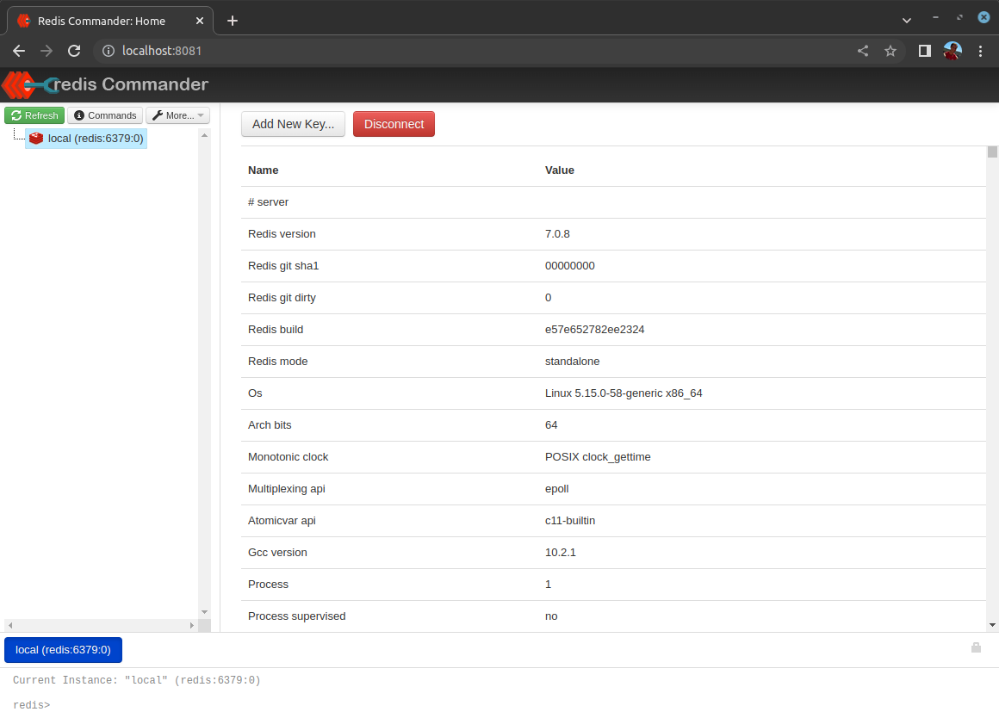
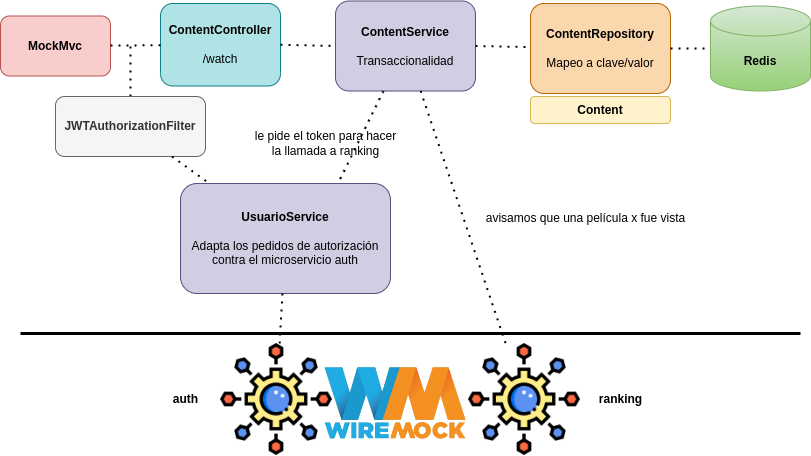

# Ejemplo Microservicios - Películas

## Módulo de Contenido (content)

[](https://github.com/uqbar-project/eg-peliculas-microservicios/actions/workflows/build-ranking.yml) [](https://codecov.io/gh/uqbar-project/eg-peliculas-microservicios)


## Instrucciones para levantar el ejemplo

Desde el directorio raíz en un shell se levanta la base de datos MongoDB con docker compose:

```bash
docker-compose up
```

En el archivo [`docker-compose.yml`](./docker-compose.yml) especificamos la imagen dockerizada de Redis que queremos utilizar, así como el servicio **Redis Commander** que levanta un cliente web para poder acceder a la base.

Si te aparece el siguiente mensaje de advertencia:

```bash
cache_1  | 1:M 02 Feb 2023 02:40:55.825 # WARNING Memory overcommit must be enabled! Without it, a background save or replication may fail under low memory condition. 
                                        # Being disabled, it can can also cause failures without low memory condition, see https://github.com/jemalloc/jemalloc/issues/1328. 
                                        # To fix this issue add 'vm.overcommit_memory = 1' to /etc/sysctl.conf and then reboot 
                                        # or run the command 'sysctl vm.overcommit_memory=1' for this to take effect.
```

Hay que hacer exactamente lo que sugiere el mensaje.

Cuando levante el contenedor de Docker podés abrir un navegador en la siguiente URL: http://localhost:8081/



### Aplicación Spring Boot

Antes de levantar la aplicación conviene levantar [el proyecto hermano que tiene la registración de los servicios en Eureka](../peliculas-microservice-registry/README.md).

Después sí, ejecutás el main del archivo PeliculasMicroserviceContentApplication.

## Arquitectura general de la aplicación

El microservicio simula ser un servidor de contenido de una plataforma de streaming, donde podés "ver" una película. Para eso intervienen varios servicios:

- la autenticación para verificar que el usuario corresponde a un abonado de la plataforma. Esto se hace enviando un token web (JWT) como método de autenticación Bearer y se delega al microservicio `auth`
- luego tenemos que simular la descarga del contenido (representado por un string -> array de bytes). No tenemos aquí un archivo real, entonces simulamos la creación de ese archivo la primera vez y lo guardamos en Redis, que nos sirve como cache para no volver a hacer la búsqueda: en la situación real deberíamos acceder a algún servidor donde están las películas y seguramente deberíamos segmentar la película o serie en "chunks". Pero para los fines didácticos el ejemplo queda bien cubierto así de forma más simple. La segunda vez que otro usuario pida el contenido de una película lo encontraremos en Redis.
- por último, queremos registrar las veces que se ve una película. Si bien esto lo podríamos guardar en Redis, preferimos que el módulo de `ranking` sea el responsable de almacenar toda la información referente a una película: título, fecha de salida, géneros, calificaciones y **vistas** para poder ordenarlo. Entonces llamaremos al microservicio de ránking avisándole que dicha película debe sumar una visualización. El detalle adicional es que la llamada a ranking se hace vía GraphQL.


## Seguridad

Para validar el usuario, utilizamos un interceptor o _Filter_ de Spring Boot: la explicación más detallada está en [el microservicio de ránking](../peliculas-microservice-ranking/README.md). Lamentablemente debemos duplicar el mismo componente en ambos microservicios (es el costo de redundancia que debemos pagar por separar módulos).

## Testing

Para testear el endpoint trabajamos con **Wiremock** simulando que auth y ranking están en el mismo puerto. Eso se configura en el archivo `application-test.yml`:

```yml
ranking:
  base-url: http://localhost:9080/graphql

auth:
  base-url: http://localhost:9080
```

Luego definimos que los tests de Spring Boot utilicen ese entorno

```kt
@SpringBootTest
@AutoConfigureMockMvc
@ActiveProfiles("test")
@DisplayName("Tests de Content")
class ContentControllerTests {
```

Wiremock va a devolver respuestas predefinidas y de esa manera tendremos 2 clases de equivalencia:

1. el caso de éxito o _happy path_ donde todo el circuito se cumple y podemos informar que la película se visualizó
2. un caso de error, donde el usuario no existe y por lo tanto no podrá descargar una película

A futuro podríamos diferenciar el caso de éxito en dos: la primera vez que pedimos el contenido de una película vs. la segunda vez que no debería requerir la llamada al repositorio de Redis. Lo dejamos como trabajo futuro o el mismo lector puede animarse a resolverlo (y de paso, a subir un PR :smile:).



